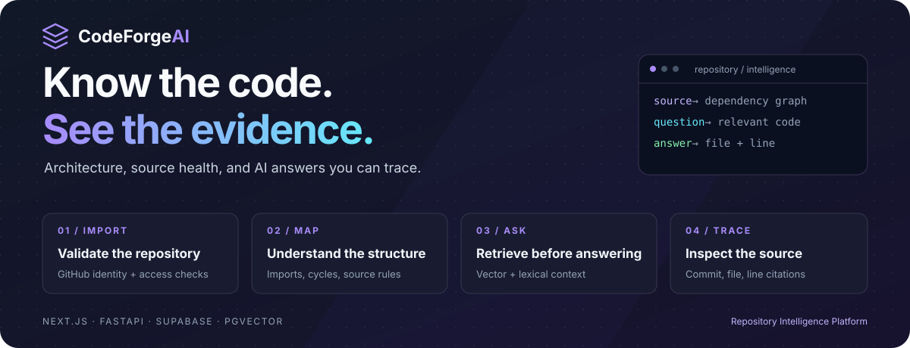
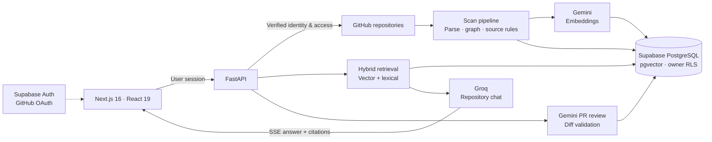

<p align="center">
  
</p>

<p align="center">
  <strong>Repository intelligence with a source trail.</strong><br />
  Explore architecture, inspect source health, review diffs, and ask questions with answers linked to the code.
</p>

<p align="center">
  <a href="https://github.com/Lingu17/codeforage-ai/actions/workflows/ci.yml"></a>
  
  
  
  
</p>

<p align="center">
  <a href="#the-product">Product</a> ·
  <a href="#engineering-decisions">Engineering</a> ·
  <a href="#architecture">Architecture</a> ·
  <a href="#verification">Verification</a> ·
  <a href="#run-locally">Run locally</a> ·
  <a href="#creator">Creator</a>
</p>

---

## The product

An unfamiliar repository raises practical questions: where does a request go, which modules depend on each other, and what evidence supports a suggested change?

**CodeForge AI turns repository source into navigable engineering context.** Import a GitHub repository, watch its scan progress, explore its dependency graph, and ask questions against retrieved source. Reports separate measured results from unavailable data, while citations lead back to the recorded GitHub commit.

| Capability | What you can do |
| :--- | :--- |
| **GitHub import** | List repositories through the user's GitHub authorization, or analyze a public repository by URL. Pagination, expired credentials, permissions, and rate limits have distinct handling. |
| **Architecture explorer** | Inspect observed internal and external imports, dependency paths, and cycles in an interactive React Flow graph. |
| **Codebase chat** | Combine vector and lexical retrieval, stream an answer, and open file/line citations at the scan's recorded commit. |
| **Source health & security** | Inspect deterministic source rules, redacted findings, file-size debt, and import cycles. Unmeasured testing, performance, and overall risk remain explicit. |
| **PR review** | Submit a bounded Git diff and inspect AI recommendations whose categories and locations are checked against changed lines. |
| **Scan visibility** | Follow persisted stages and indexing counts, distinguish complete/partial/failed work, and recover interrupted scans through retry. |

### A workflow you can follow

**Import → parse → map → analyze → index → ask → inspect citations**

The pipeline persists individual stage outcomes. Analysis and indexing can run concurrently; the UI reports their actual progress rather than simulating a successful scan.

## Engineering decisions

The interesting work is in the boundaries between authentication, indexing, retrieval, and persistence. These are concrete places to inspect the implementation:

| Engineering problem | Implementation | Inspect the code |
| :--- | :--- | :--- |
| A revoked token should not break public URL analysis | Public access is attempted independently; a hidden/not-found repository is retried only with the supplied user's GitHub authorization. | [GitHub import](frontend/src/utils/githubImport.ts), [API & error classification](backend/github_client.py) |
| Retrieval must stay inside the selected repository | Vector and lexical RPCs are scoped by repository; results are fused by reciprocal rank and bounded before model generation. | [Hybrid retrieval](backend/rag.py), [owner policies & RPCs](backend/migration_v6.sql) |
| Stream interruption must not become a successful saved answer | Durable request claims and transactional assistant persistence distinguish busy, completed, failed, and replayed requests. | [Chat stream tests](backend/tests/test_chat_stream.py), [transactional RPCs](backend/migration_v7.sql) |
| Embedding failures must remain visible | Batch limits, vector validation, bounded retries, and persisted coverage produce partial/failed outcomes when necessary. | [Embedding validation](backend/embedding.py), [scan pipeline](backend/scanner.py) |
| Old defaults can look like real measurements | Reports without measurement evidence show unavailable scores; unknown coverage and risk are not labeled successful or safe. | [Report presentation](backend/reporting.py), [regression tests](backend/tests/test_reporting.py) |
| Generated review locations can be wrong | Diff parsing limits recommendations to actual added lines and supported issue categories. | [Review validation](backend/pr_review.py) |
| A secret can accidentally become browser configuration | Public configuration rejects modern Supabase secret keys and legacy service-role JWTs; release scans inspect Git content without printing credentials. | [Public environment guard](frontend/src/utils/publicEnvSafety.ts), [release guard](tools/check_release.py) |

Repository code is parsed, **not executed**. Retrieved source is treated as untrusted data, and private access requires user authorization. These controls reduce specific risks; they do not make model output inherently trustworthy.

## Architecture



- **Frontend:** Next.js App Router, TypeScript, Tailwind CSS, React Flow, and Supabase session handling.
- **Backend:** FastAPI, source parsing, scan orchestration, hybrid retrieval, and streamed chat.
- **Data:** Supabase Auth, PostgreSQL, 768-dimensional pgvector embeddings, RLS policies, and transactional chat RPCs.

The scan worker runs in-process. Persisted state and stale-job recovery make interruptions visible; this is **not a distributed task queue**.

## Verification

**Latest documented application verification: October 10, 2026.** Counts below are observed results, not coverage percentages or permanent guarantees.

| Gate | Verified evidence |
| :--- | :--- |
| Backend regression suite | **119 tests passed** |
| Frontend regression suite | **22 tests passed** |
| Type checking & production build | Passed; **23 pages generated** |
| Database CI | V8 migration replay, missing/partial-schema repair, schema contracts, chat RPCs, and two-user RLS isolation passed on a disposable PostgreSQL/pgvector runner. |
| Live local workflow | GitHub sign-in and listing, public URL import, complete indexing, cited chat with reload persistence, and example PR review verified. |
| Public scan sample | `pallets/itsdangerous`: **74/74 chunks indexed**, zero failed chunks; 30 discovered files, 29 files with indexed chunks. |
| Runtime dependency audits | Backend pinned dependencies and frontend production dependencies had no known findings at verification time. |
| Secret signatures | Candidate/staged Git content and public build assets passed the signature scan. |

**Inspect the evidence:** [verified release CI](https://github.com/Lingu17/codeforage-ai/actions/runs/38039809035) · [current workflow](.github/workflows/ci.yml) · [detailed audit](AUDIT.md)

<details>
<summary><strong>Release boundaries and known limitations</strong></summary>

- Five high-severity **development dependency** findings remain in the Next ESLint dependency chain; 126 configured lint warnings remain. A clean runtime audit does not remove those findings.
- Private repository reconnect/import and distinct-user **live** Supabase RLS remain unverified. Disposable CI isolation checks are separate evidence.
- Vercel reported successful frontend deployment, but the available browser required Vercel sign-in. Hosted end-to-end behavior was not independently verified.
- Source health is a limited rule-based measurement, not a production-readiness score. Test coverage and runtime performance are unmeasured; language and dependency auditing coverage is limited.
- Repository content, reports, diffs, and chat are retained in Supabase. Relevant source is sent to configured Gemini/Groq providers; assess consent, retention, and isolation before using sensitive code.
- Paid billing, enterprise SSO, and team collaboration are not implemented. Optional contact submission is disabled until its backend-only privileged client is configured.

See [AUDIT.md](AUDIT.md) for findings and [DATABASE_RELEASE_PLAN.md](DATABASE_RELEASE_PLAN.md) for migration and deployment gates. The project is a verified local implementation with remaining production acceptance work.

</details>

## Run locally

### 1. Prepare the environment

Use **Node.js 24** and **Python 3.14**, matching CI. You also need your own Supabase project and authorized Gemini/Groq configuration.

From the repository root in PowerShell:

```powershell
python -m venv .venv
.\.venv\Scripts\python -m pip install -r backend/requirements-dev.txt

# Preserve any existing local configuration.
if (!(Test-Path backend/.env)) {
  Copy-Item backend/.env.example backend/.env
}
if (!(Test-Path frontend/.env) -and !(Test-Path frontend/.env.local)) {
  Copy-Item frontend/.env.example frontend/.env.local
}
```

Populate the placeholders privately. Server configuration uses `SUPABASE_URL`, `SUPABASE_ANON_KEY`, `GEMINI_API_KEY`, `GROQ_API_KEY`, and available generation/chat model names. Keep the embedding dimension at **768**. Browser configuration contains only the public Supabase URL/key and `NEXT_PUBLIC_API_URL`; privileged keys never belong in `NEXT_PUBLIC_*` variables.

### 2. Configure database and OAuth

- For a **fresh** database, review the [base schema](backend/supabase_schema.sql), then apply migrations **V3 → V4 → V5 → V6 → V7 → V8** in order. V2 is for legacy table names only. For an existing database, review its catalog and the [release plan](DATABASE_RELEASE_PLAN.md) before any migration; do not blindly replay initialization.
- Enable GitHub OAuth through Supabase. Register the provider callback with GitHub and allow the local application redirect `http://localhost:3000/auth/callback` in Supabase. Use the same origin throughout sign-in.
- Standard sign-in does not request private repository scope. Explicit private-access reconnection requests `repo`; organization SSO approval may also be required.
- Do not run the destructive `backend/tests/migration_v8.sql` fixture against staging or production. It belongs only in the disposable CI database.

### 3. Start both services

**Terminal A — backend, from the repository root:**

```powershell
Set-Location backend
..\.venv\Scripts\python -m uvicorn main:app --host 127.0.0.1 --port 8000
```

**Terminal B — frontend, from the repository root:**

```powershell
Set-Location frontend
npm ci
npm run dev
```

| Endpoint | Purpose |
| :--- | :--- |
| [localhost:3000](http://localhost:3000) | Application and GitHub sign-in |
| [127.0.0.1:8000/docs](http://127.0.0.1:8000/docs) | FastAPI documentation |
| [127.0.0.1:8000/health](http://127.0.0.1:8000/health) | Process liveness |
| [127.0.0.1:8000/ready](http://127.0.0.1:8000/ready) | Database/schema readiness; returns 503 on failure |

`ALLOWED_ORIGINS` must match the frontend origin. Do not deploy a local `.env` unchanged; production configuration requires explicit HTTPS origins and valid provider settings.

## Development checks

From the repository root, using the configured Python environment:

```powershell
python -m pytest backend/tests -q
python backend/schema_check.py
python tools/check_release.py
git diff --check
```

From `frontend/`:

```powershell
npm test
npm run typecheck
npm run lint
npm run build
npm audit --omit=dev
npm audit
```

The [GitHub Actions workflow](.github/workflows/ci.yml) adds backend security/dependency checks and disposable Docker database verification. Database fixtures do not connect to your configured Supabase project. Full npm audit currently reports the development findings described above.

## Project map

```text
codeforage-ai/
├── frontend/                 Next.js application and UI regression tests
├── backend/
│   ├── main.py               Authenticated API and streaming endpoints
│   ├── scanner.py            Parsing, graph generation, scan stages
│   ├── rag.py                Repository-scoped hybrid retrieval
│   ├── embedding.py          Vector validation and provider retries
│   ├── reporting.py          Evidence-aware report presentation
│   ├── migration_v*.sql      Database evolution and access policies
│   └── tests/                Python regressions and SQL contract/isolation tests
├── tools/                    Release guard and authorized staging smoke checks
├── docs/assets/              Custom README visual assets
├── .github/workflows/ci.yml  Database, backend, and frontend verification
├── AUDIT.md                  Results, findings, and verification boundaries
└── DATABASE_RELEASE_PLAN.md  Database maintenance and release procedures
```

## Creator

**Lingraj Malipatil** · [GitHub @Lingu17](https://github.com/Lingu17) · [LinkedIn](https://www.linkedin.com/in/lingraj-malipatil-a2735a241/)

This project demonstrates work across full-stack product development, applied AI retrieval, database authorization, and failure-aware backend workflows. For a technical discussion, start with [retrieval](backend/rag.py), [scan orchestration](backend/scanner.py), or the [RLS isolation tests](backend/tests/rls_isolation.sql).

---

<p align="center"><strong>CodeForge AI</strong><br />Understand the repository. Follow the evidence.</p>
